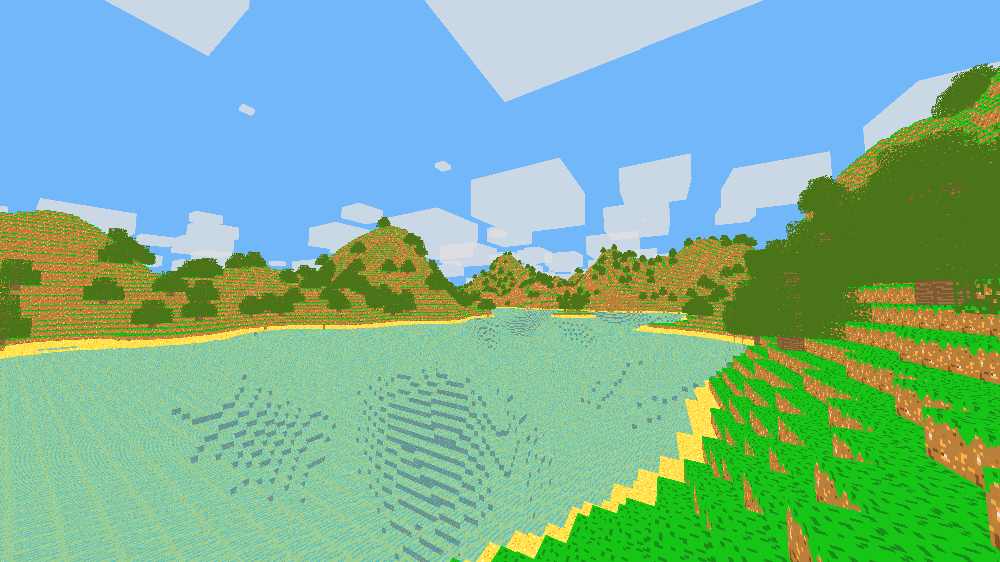
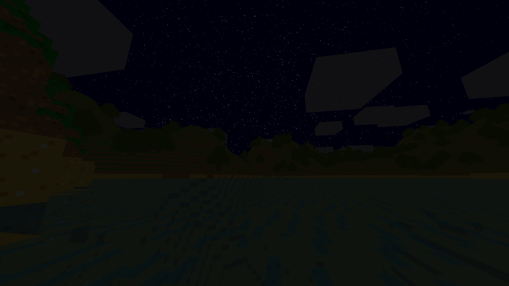

## Overview
A voxel game built for performance and efficiency.



<br>
<sup>In-game screenshots during the day and night</sup>

## Features
This game offers a wide variety of features to create a vast gameplay experience while allowing for new features to be trivially added.

Examples include:
- **64-bit** generation to allow worlds to span _trillions_ of blocks
- [Dynamic skybox](src/World/Sky.cpp) with clouds, stars and the sun and moon
- Custom [text rendering system](src/Rendering/TextRenderer.cpp) that supports different colours, sizes and other features
- Chatting and [commands](tab=readme-ov-file#commands)

## Goal
The purpose of this game is to achieve extreme performance using OpenGL in C++ while still offering many features and possibly serving as inspiration for others attempting to create 3D software using graphics libraries.

### Possible additions
There are still many things that could be improved about the game. The most likely additions include:
- Main menu with world select and saving
- Biomes and more varied terrain (caves, structures, etc)
- Controller support
- Player model
- Lighting

## Commands
Commands have been [implemented](src/Application/Application.hpp) in a way that makes creating new ones extremely trivial. The defaults allow for easy exploration and manipulation of the game and the world.

### Syntax
To write a command, use the chat with a forward slash as the first character, immediately followed by the command name and then any (or no) arguments seperated with spaces: 

`/name arg1 arg2...`

A message written with the first character as anything else will be treated as a chat message otherwise.

Any command argument marked with an **asterik (*)** is optional. If the command has only one argument and it is optional, entering the command _without_ any arguments acts as a query for the value it changes. 

>Example: `/time 256` will change the current game time to 256 seconds whereas `/time` will display the current time in the chat.

Using a **tilde (~)** as an argument will be treated as the current value. Any number after the tilde will be **added** to the value.

>Example: `/tp ~ ~10 ~` will move the player +10 blocks in the Y axis and `/tp ~ ~-10 ~` will move them downwards by 10 blocks.

#### Notable examples include:
- /tp x y z *p *y - Teleport to the specified coordinates with optional arguments to set camera pitch and yaw. Scientific notation and other keywords are allowed.
- /speed *n - Change the player's current speed to the specified value.
- /rd *n - Changes the render distance to the specified value \[0, 50\]
- /tick *n - Change the tick speed to the specified value, which affects the speed at which in-game time passes. \[-100, 100\]
- /time *n - Change the current in-game time to the specified value.
- /fov *n - Change the camera's field of view to the specified value.
- /fill x<sub>1</sub> y<sub>1</sub> z<sub>1</sub> x<sub>2</sub> y<sub>2</sub> z<sub>2</sub> id - Fills from the first position to the second (all inclusive) with the specified block ID<sup>^</sup>
- /clear - Clears the chat

Writing any command with the only argument as `?` (or an invalid number of arguments) will display help for that command if available.

<sub><sup>^</sup>A full list of all the blocks and their associated IDs and properties can be found in the [following file](src/World/Generation/Settings.hpp).</sub>

</img>
<sup>In-game screenshot with GUI enabled</sup>

## Controls
The implementations of controls can also be viewed and easily edited in [this file](src/Application/Callbacks.cpp). 

Default controls are as follows:
- Movement: **WASD**
- Write command: **/** (forward slash)
- Exit game/close chat: **ESC**

### Toggle inputs:
- Toggle fullscreen: **F**
- Toggle vertical sync: **X**
- Toggle inventory: **E**
- Toggle gravity: **C**
- Toggle noclip: **N**
- Toggle chunk generation: **V**

### Value inputs*
- Change speed: **COMMA** and **PERIOD**
- Change FOV: **I** and **O**
- Change render distance: **[** and **]** (square brackets)

### Function inputs
- Toggle all GUI: **F1**
- Take screenshot: **F2**
- Free cursor: **F3**
- Toggle debug text: **F4**

### Debug inputs
- Wireframe: **Z**
- Reload shaders: **R**
- Toggle chunk borders: **J**
- Rebuild chunks: **U**

<sub>* The first input increases the value whilst the other decreases it.</sub>
## Build
To compile and run the game, you can simply use [CMake](https://cmake.org/).

If you are using the **CMake GUI**, you can follow these steps:
- Specify root and build directory
- Press 'Configure' on the left above the output section
- Press 'Yes' on the prompt to create a new folder (if the folder does not exist)
- Specify generator and other settings if needed and press 'Finish'
- Press 'Configure' again then 'Generate' to create the binaries

If you are using CMake in a **terminal**, you can run the following (with your own directories and settings):

```bash
$ cmake -S [source-dir] -B [build-dir]
```

If you encounter any problems, feel free to create a new issue so it can be resolved.

<sup>If you are using MSVC, you can compile using the /MP flag to do so in parallel.</sup>

## Libraries
This game makes use of a few libraries to work. They can be seen in the 'libraries' folder or below. Make sure to support them, this would not be possible without them!

[lodepng](https://github.com/lvandeve/lodepng) - PNG encoder and decoder

[GLM](https://github.com/icaven/glm) - OpenGL maths library

[GLFW](https://github.com/glfw/glfw) - Window and input library

[glad](https://github.com/Dav1dde/glad) - OpenGL loader/generator

[fmt](https://github.com/fmtlib/fmt) - Formatting library
