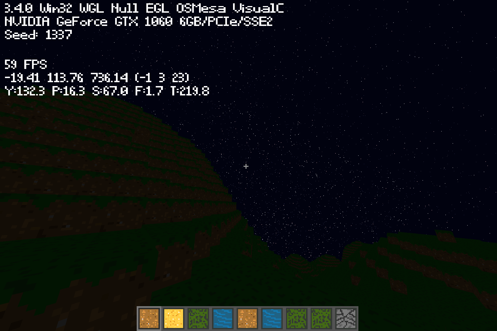

# Badcraft
A voxel-type game inspired by Minecraft, designed to be performant (in terms of memory usage and FPS), cross-compatible and easy to change.


<sup>In-game screenshot of Badcraft (1800x1200)</sup>

## Features
- 64-bit rendering and generation system, allowing for worlds to span **trillions** of blocks with no issues*
- Custom text rendering system that supports different sizes and colours
- Event logging system in console
- Dynamic skybox with clouds and night stars
- Commands (see [Commands](https://github.com/mahdialmusaad/badcraft/tree/main?tab=readme-ov-file#commands))
- Screenshotting (see [Controls](https://github.com/mahdialmusaad/badcraft/tree/main?tab=readme-ov-file#controls))

<sup>\*Due to precision limitations, terrain rendering breaks down at around 10<sup>18</sup> blocks from spawn.</sup>
## Goal
Badcraft was developed with performance and cross-compatibility in mind.
Using [CMake](https://cmake.org/) and the provided [CMakeLists.txt](https://github.com/mahdialmusaad/badcraft/blob/main/CMakeLists.txt), you can build and run Badcraft on different platforms. See the [Build](ttps://github.com/mahdialmusaad/badcraft/tree/main?tab=readme-ov-file#build) section for more details.
### Possible additions
There are still many things that could be improved about the game, but implementing them could prove to be difficult or possibly involve major changes of existing parts of the source code:
- Greedy meshing ([currently in development](https://github.com/mahdialmusaad/badcraft/blob/main/src/World/Chunk.cpp))
- A sun and moon in the sky during their respective times and clouds that aren't spawn-bound (planned)
- Player model
- Chatting feature
- Structures
- More inventory features (dragging, amount display, dropping)
- Crafting and other blocks with their own respective GUIs
- Controller support
## Commands
Commands are also available to make exploring and editing the world easier! The implementations can be seen in the [application C++ file](https://github.com/mahdialmusaad/badcraft/blob/main/src/Utility/Application.cpp) ('ApplyChat' function)
- /tp x y z - Teleport to specified x, y and z coordinates. Scientific notation and words such as 'inf' are accepted.
- /speed n - Change the player's current speed to the specified value.
- /tick n - Change the game tick speed to the specified value (affects how fast time passes in-game)
- /exit - Exits the game. What did you expect?
- /dcmp id - (DEBUG) Outputs the assembly code of the specified shader ID into 'bin.txt'
- /fill x<sub>1</sub> y<sub>1</sub> z<sub>1</sub>  x<sub>2</sub> y<sub>2</sub> z<sub>2</sub> id - Fills from the first position to the second with the specified block ID*

\*A full list of all the blocks and their associated IDs and properties can be found in the [settings header file](https://github.com/mahdialmusaad/badcraft/blob/main/src/World/Generation/Settings.hpp).
## Controls
The implementations of controls can be viewed and easily edited in the [application header file](https://github.com/mahdialmusaad/badcraft/blob/main/src/Utility/Application.hpp). Currently, they are:
- Movement: **WASD**
- Toggle VSYNC: **X**
- Wireframe: **Z**
- Write command: **/** ('forward slash')
- Exit/exit commands (if currently typing one): **ESC**
- Reload shaders: **R**
- Toggle inventory: **E**
- (DEBUG) Toggle collision: **C**
- (DEBUG) Toggle generation: **V**
- Change speed (increase and decrease respectively): **COMMA** and **PERIOD**
- Change FOV (increase and decrease respectively): **O** and **I**
- Toggle GUI: **F1**
- Take screenshot: **F2**
- Free cursor: **F3**

Only keyboard and mouse input is supported as of now. Controllers and other input devices will currently not function.
## Build
To run Badcraft, you can use CMake along with the provided CMakeLists.txt.

If you are using the **CMake GUI**, you can follow these steps:
- Specify root directory for 'source code'
- Specify a folder (e.g. badcraft/build/) for where CMake will build the binaries
- Press 'Configure' on the left above the output section
- Press 'Yes' on the prompt to create a new folder (if the folder does not exist)
- Specify generator and other settings if needed and press 'Finish'
- Press 'Generate' to create the binaries

If you are using CMake in a **terminal**, you can run the following (replace directories and optional settings with your own):

```bash
$ cmake optional-settings -S source-directory -B build-directory
```

If you encounter any problems, please create a new issue so it can be resolved.

<sup>Tip: If using MSVC, you can compile using the /MP flag to do so in parallel.</sup>
## Libraries
[lodepng](https://github.com/lvandeve/lodepng) - PNG encoder and decoder

[GLM](https://github.com/icaven/glm) - OpenGL maths library

[GLFW](https://github.com/glfw/glfw) - Window and input library

[GLAD](https://github.com/Dav1dde/glad) - OpenGL loader/generator