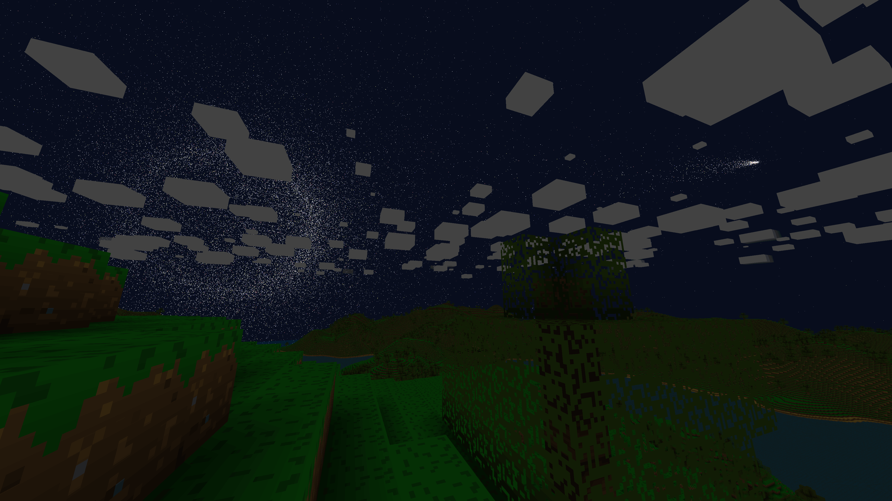
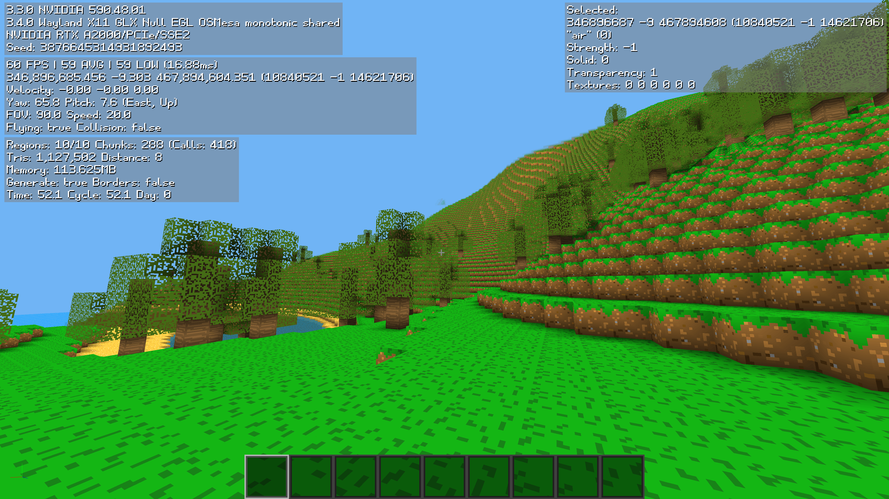

## Overview
A procedural open-world game written in C.

</img>
<br>
<sup>In-game screenshot during the night</sup>

## Features
- **64-bit** generation to allow worlds to span extreme distances
- [Dynamic skybox](src/world/sky.c) with clouds, stars and other features
- [Custom text rendering system](src/text/text_obj.c) with formatting support
- Chatting and [commands](#Commands)
- [Run-time mod support](src/values/elements.c) for shaders, blocks, textures and even vertices

## Mod support
Blocks, shaders and textures are all sourced from the `resources` directory. They can be reloaded at any time with a keypress (see [Controls](#Controls)).
<br>
Help files are included in the aforementioned directory to specify data formats. Each data file in the `resources/elements` directory can include comments with a '#' before the text to be commented out.

### Shaders
([See the help file for more details](resources/shaders/shader_info.txt))
<br>
Each shader file contains first the vertex _then_ the fragment code, separated with an '@' character. The `#version` and any used textures and/or UBOs are automatically added. To specify an instanced attribute, the `location` value should contain a preceding `0` before the actual value.

>Example: `layout(location = 1)` specifies a normal attribute whereas `layout(location = 01)` will be identified as an instanced attribute and relevant divisor settings will be applied.

### Textures
([See the help file for more details](resources/textures/tex_info.txt))
<br>
All textures in `resources/textures/blocks` must follow the format specified in the aforementioned file (RGBA PNG, 16x16), otherwise they will be ignored. Blocks without textures will have the `air` texture (debug black-and-pink texture). Other textures should be placed in `resources/textures/gui` and can have any size.

### Blocks
([See the help file for more details](resources/elements/blocks.txt))
<br>
Adding a block requires only a name and a strength value. The 'strength' value determines collision (-1 to disable) and generation priorities. Adding a texture only requires that the desired PNG image in `resources/textures/blocks` contains the same name initially, with the specific axis/faces to appear on being determined from an axis prefix on the name.
<br>
>Example: A texture named `grassXYZ.png` will be applied to the positive X, Y and Z directions of any 'grass' block, whereas `grassxyz.png` will apply to the negative directions. Any combination of the axis can be used.

If a texture will replace an existing one, a warning will be logged to the output. If the filename (excluding the .png) fully matches, it will be applied to all faces.

>Example: A texture named `grass.png` will be applied to all faces.

### Vertices
([See the help file for more details](resources/elements/vertices.txt))
<br>
The vertices and indices of a given block can also be specified. The format is as follows:
```
@name_suffix
%AXIS index1 index2 index3 ...
X Y Z U V
X Y Z U V
...
%AXIS ...
```
`name_suffix` specifies what type of block will use the given vertex data. If any block name (specified as seen [above](#Vertices)) ends with the specific suffix, or the names match exactly, it will use this vertex data. By default, the first entry will be used.
<br><br>
`AXIS` specifies which face direction this is targeting. Available values are the same as textures (capital XYZ for positive directions, lowercase for negative).
<br><br>
`index1 index2...` specifies the EBO indices for the following vertex data.
<br><br>
`X Y Z U V` specifies the _normalized_ 3D position and 2D texture position of the vertex.

## Commands
Commands can be used to edit the world or settings. They can be created and changed easily in the [source file](src/events/commands_list.c).

### Syntax
To write a command, use the chat with a _forward slash_ as the first character, immediately followed by the command name and then any arguments separated with spaces: <br>
`/name arg1 arg2...`

A message written _without_ a **forward slash ( / )** at the start else will be treated as a chat message instead.

Any command argument marked with an **asterik ( \* )** is optional. Only arguments not marked with one are needed to run. However, if the command has an associated _query_ function, running the command **without** any arguments will display the values for related variables.

>Example: <code>/time 256</code> will <i>change</i> the current game time whereas <code>/time</code> will <i>display</i> the current time in the chat.

Using a **tilde (~)** as an argument will be treated as the current value for select commands. Any number after the tilde will be **added** to the value.

>Example: <code>/tp ~ <b>~10</b> ~</code> will move you up 10 blocks in the Y axis whereas <code>/tp ~ ~<b>–10</b> ~</code> will move you downwards by 10 blocks.

A **negative symbol (–)** can also be added _before_ the tilde to negate the resulting value.

>Example: <code>/tp ~ <b>–~10</b> ~</code> will first calculate the +10 of your Y position then negate it. If the Y position was 50, it would be changed to –60 as 50 + 10 = 60 and then 60 \* –1 = –60.

The command '**/help**' displays information on how commands are formatted. It also provides a list of all normal commands and descriptions of their purpose.

### Examples:
- /**tp** x y z *pitch *yaw - Teleport to the specified coordinates and optionally set camera orientation.
- /**set** x y z id - Replaces the block at the specified coordinates to the given block ID.
- /**speed** *n - Change the player's current speed to the specified value.
- /**tick** *n - Change the tick speed to the specified value, which affects how fast in-game time passes.
- /**time** *n - Change the current in-game time to the specified value. The day-night cycle is respected.
- /**fov** *n - Change the camera's field of view to the specified value.
- And more!

Writing any command with the only argument as `?` or with an invalid number of arguments will display help for that command.

<hr>

</img>
<sup>In-game screenshot with GUI enabled</sup>

## Controls
The implementations of controls can be viewed and edited in [this file](src/events/keys_list.c).
<br>
Default controls are as follows:
### General inputs:
- Movement: **WASD**
- Zoom: **G**
- Write command: **/**
- Write chat message **T**
- Exit game/close chat: **ESC**

### Toggle inputs
- Toggle vertical sync: **X**
- Toggle inventory: **E**
- Toggle fog: **F**
- Toggle gravity: **C**
- Toggle noclip: **N**
- Toggle chunk generation: **V**

### Value inputs
- Change speed: **K** (+) and **L** (-)
- Change FOV: **I** (+) and **O** (-)
- Change render distance: **[** (+) and **]** (-)

### Function inputs
- Toggle all GUI: **F1**
- Take screenshot: **F2** (Saved into the `screenshots` directory)
- Free cursor: **F3**
- Toggle debug text: **F4**

### Debug inputs
- Toggle wireframe view: **Z**
- Toggle chunk borders: **J**
- Reload elements (shaders, meshes, etc.): **R**
<br><br>

Some values are limited to certain ranges. This also applies when setting the same values using commands.

## Arguments
The game can be run with a few command-line settings that can be found [here](src/main.c). A list of all of them are shown when running the game with `--help`.
<br>
Single-character arguments can be combined to specify multiple options at once.

## Build
To build the game, [CMake](https://cmake.org/) and [git](https://git-scm.com/) (if [GLFW](https://glfw.org) is not installed) is required. Your device **must support at least OpenGL 3.3**.
<br>
You can then obtain the source from the above `Code` button, then run the following commands in the downloaded directory:
```bash
cmake -B ./build
cmake --build build
```
The resulting executable can be found in the `game` directory alongside required resources.

## Changelog
### v1.0.6:
- Game now uses highest supported OpenGL version (still requires at least 3.3)
- OpenGL debug messages are enabled if supported
- Fixes for MSVC compilation
### v1.0.5:
- Chat fixes
- Windows compilation fixes
- Scaling fixes for initialization
- In-game warning fixes for duplicate face textures
