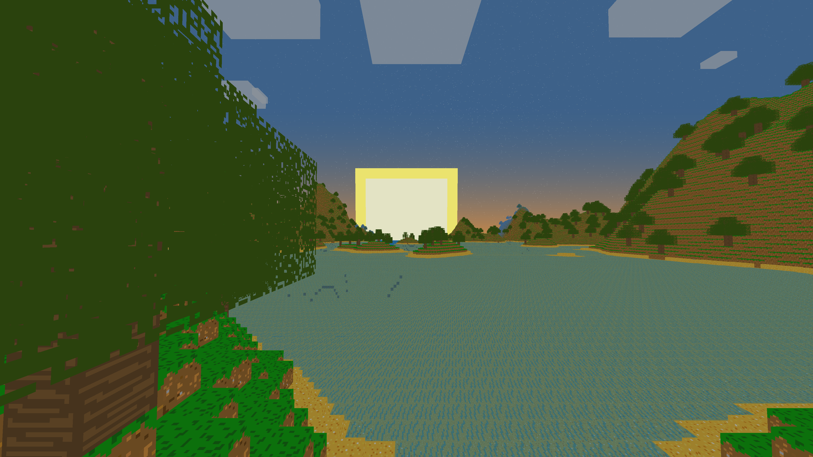

# Badcraft
A voxel game built to be performant, memory-efficient and cross compatible.


<sup>In-game screenshot of Badcraft (Windows)</sup>

## Features
- 64-bit rendering and generation system, allowing for worlds to span **trillions** of blocks with no issues*
- Custom text rendering system that supports different sizes and colours
- Dynamic skybox with clouds and night stars
- Screenshotting (see [Controls](https://github.com/mahdialmusaad/badcraft/tree/main?tab=readme-ov-file#controls))
- Commands (see [Commands](https://github.com/mahdialmusaad/badcraft/tree/main?tab=readme-ov-file#commands))

<sup>\*Due to precision limitations, terrain rendering begins to break down at 2<sup>53</sup> (9 quadrillion) blocks away from the origin.</sup>

## Goal
Badcraft was developed with performance and cross-compatibility in mind to ensure that anyone can use it, no matter their hardware or operating system.
See the [Build](ttps://github.com/mahdialmusaad/badcraft/tree/main?tab=readme-ov-file#build) section for more details.

### Possible additions
There are still many things that could be improved about the game, but implementing them could prove to be difficult or possibly involve major changes of existing parts of the source code:
- Greedy meshing ([currently in development](https://github.com/mahdialmusaad/badcraft/blob/main/src/World/Chunk.cpp))
- A sun and moon in the sky during their respective times and clouds that aren't spawn-bound (planned)
- Biomes/more varied terrain
- Chatting feature combined with existing commands feature
- Structures
- Controller support

## Commands
Commands are also available to make exploring and editing the world easier! The implementations can be seen in the [application source file](https://github.com/mahdialmusaad/badcraft/blob/main/src/Utility/Application.cpp) ('ApplyChat' function)
- /tp x y z - Teleport to specified x, y and z coordinates. Scientific notation and other keywords are allowed (e.g. inf, NaN).
- /speed n - Change the player's current speed to the specified value.
- /tick n - Change the tick speed to the specified value, which affects the speed at which in-game time passes.
- /time n - Change the current in-game time to the specified value.
- /exit - Exits the game.
- /fill x<sub>1</sub> y<sub>1</sub> z<sub>1</sub>  x<sub>2</sub> y<sub>2</sub> z<sub>2</sub> id - Fills from the first position to the second with the specified block ID*

\*A full list of all the blocks and their associated IDs and properties can be found in the [settings header file](https://github.com/mahdialmusaad/badcraft/blob/main/src/World/Generation/Settings.hpp).

</img>
<sup>Commands feature (see bottom-left of image)</sup>

## Controls
The implementations of controls can also be viewed and easily edited in the [application source file](https://github.com/mahdialmusaad/badcraft/blob/main/src/Utility/Application.cpp). Currently, they are:
- Movement: **WASD**
- Toggle VSYNC: **X**
- Wireframe: **Z**
- Write command: **/** (forward slash)
- Exit game or cancel command (if currently typing one): **ESCAPE**
- Reload shaders: **R**
- Toggle inventory: **E**
- (DEBUG) Toggle collision: **C**
- (DEBUG) Toggle generation: **V**
- Change speed (increase and decrease respectively): **COMMA** and **PERIOD**
- Change FOV (increase and decrease respectively): **I** and **O**
- Change render distance (increase and decrease respectively): **[** and **]** (square brackets)
- Toggle GUI: **F1**
- Take screenshot: **F2**
- Free cursor: **F3**

Only keyboard and mouse input is supported as of now. Controllers and other input devices will currently not function.

## Build
To run Badcraft, you can use [CMake](https://cmake.org/) and the provided [CMakeLists.txt](https://github.com/mahdialmusaad/badcraft/blob/main/CMakeLists.txt).

If you are using the **CMake GUI**, you can follow these steps:
- Specify root directory for 'source code'
- Specify a folder (e.g. badcraft/build/) for where CMake will build the binaries
- Press 'Configure' on the left above the output section
- Press 'Yes' on the prompt to create a new folder (if the folder does not exist)
- Specify generator and other settings if needed and press 'Finish'
- Press 'Generate' to create the binaries

If you are using CMake in a **terminal**, you can simply run the following, providing your own directories and other settings (generator, toolset, etc).

```bash
$ cmake -S [source-dir] -B [build-dir]
```

An example on Windows (assuming using Visual Studio) would be:

```bash
$ cmake -S C:/Users/.../Downloads/badcraft-main -B C:/Users/.../Downloads/badcraft-main/build -G "Visual Studio 17 2022"
```

If you encounter any problems, please create a new issue so it can be resolved.

<sup>Tip: If you are using MSVC, you can compile using the /MP flag to do so in parallel.</sup>

## Libraries
[lodepng](https://github.com/lvandeve/lodepng) - PNG encoder and decoder

[GLM](https://github.com/icaven/glm) - OpenGL maths library

[GLFW](https://github.com/glfw/glfw) - Window and input library

[GLAD](https://github.com/Dav1dde/glad) - OpenGL loader/generator
